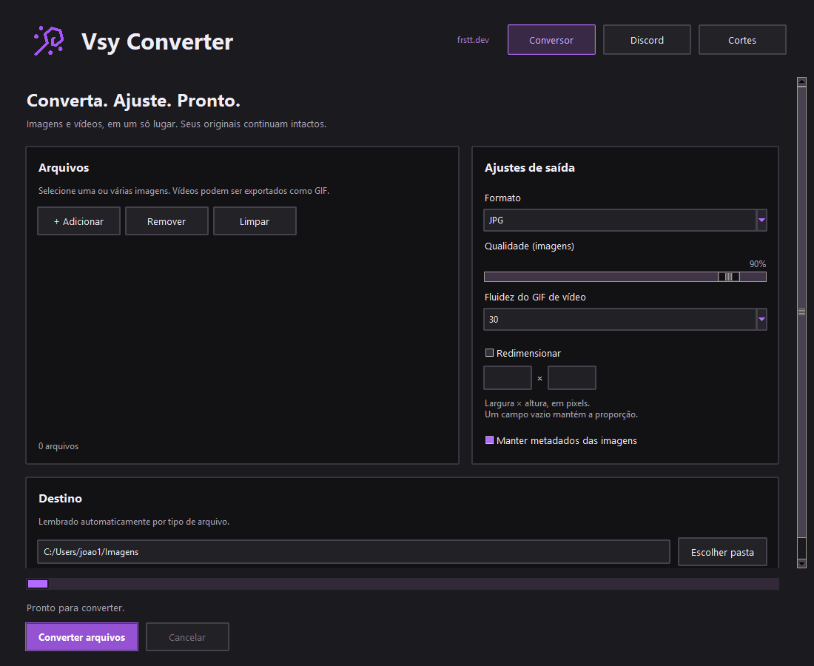
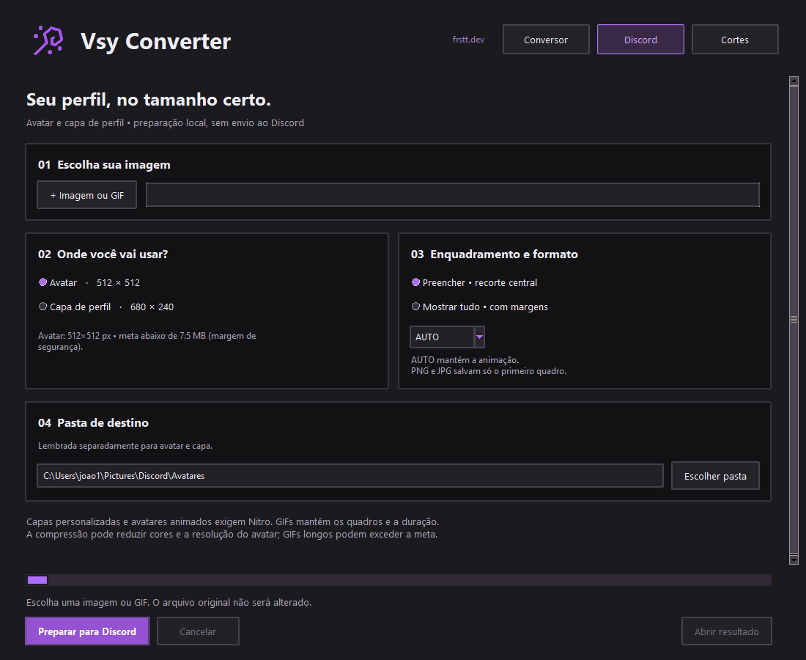
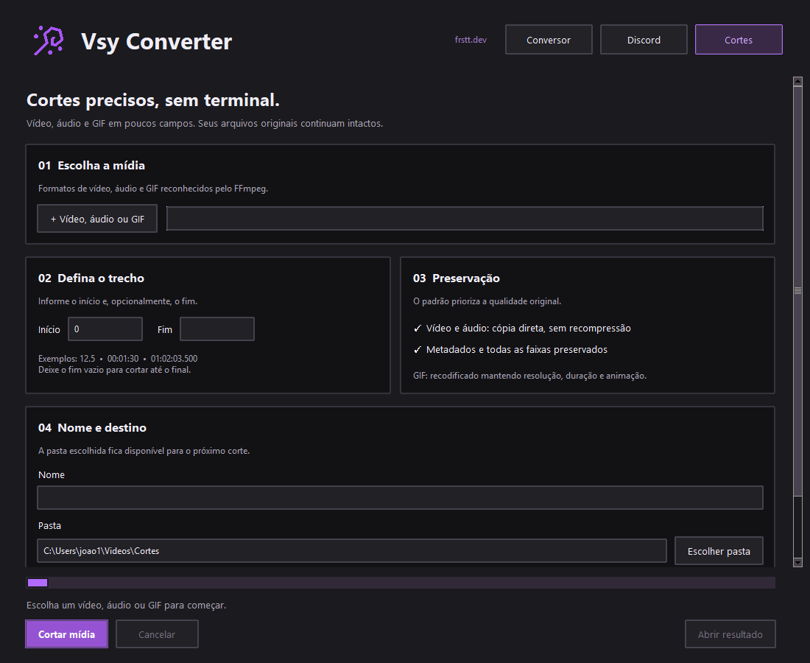

<div align="center">
  

  <p><strong>Conversão de imagens simples, rápida e sem terminal.</strong></p>

  
  
  

  <br><br>
  <a href="https://github.com/frsttw/vsy-converter/releases/latest/download/Instalador-Vsy-Converter.exe">
    
  </a>
</div>

## Sobre

O **Vsy Converter** oferece uma interface gráfica para o ImageMagick e o FFmpeg. Converta imagens, transforme vídeos em GIF e corte mídias sem memorizar comandos ou abrir o terminal.

## Destaques

- Conversão de vários arquivos em uma única operação.
- Suporte a JPG, PNG, WebP, AVIF, GIF, BMP, TIFF, ICO e PDF.
- Controle de qualidade com resultado visível e previsível.
- Redimensionamento com preservação automática da proporção.
- Opção para manter ou remover metadados.
- Proteção dos arquivos originais e numeração automática de nomes repetidos.
- Memória automática da pasta de destino para cada tipo de saída.
- Conversão para GIF de formatos de vídeo modernos, antigos, profissionais e de celular suportados pelo FFmpeg.
- Controle de fluidez do GIF entre 10 e 60 FPS, com preferência memorizada.
- Interface em grafite e violeta, com navegação no topo e opções organizadas em cartões.
- Ações sempre acessíveis, rolagem em janelas menores e cancelamento nas duas áreas.
- Aba Cortes para vídeo, áudio e GIF, com início/fim e saída no formato original.
- Vídeo e áudio são cortados por cópia direta dos fluxos, sem recompressão ou perda de qualidade.
- Instalador completo com o ImageMagick incluído.

## Como usar

1. Adicione uma ou mais imagens.
2. Escolha o formato de saída e a qualidade.
3. Se desejar, ative o redimensionamento.
4. Selecione a pasta de destino.
5. Pressione **Converter arquivos**.

## Interface



### Novidades da versão 2.6

- Novo layout para o conversor e a área Discord, mantendo a identidade violeta.
- GIFs na área Discord usam uma paleta global em duas passagens de leitura sequencial pelo FFmpeg, evitando armazenar todos os quadros descompactados de uma vez.
- Durante a codificação, o progresso mostra o quadro atual, o total e o tempo da etapa. A análise de cores tem indicador de atividade próprio.
- Exportações acima da meta informam o tamanho obtido, sem salvar um resultado inadequado.
- Conversão geral com cancelamento, arquivos temporários e configurações protegidas durante o processamento.
- Crédito visual discreto para o site pessoal `frstt.dev` no cabeçalho do aplicativo.

O tempo de exportação depende da duração, resolução e conteúdo da animação. Se uma tentativa ultrapassar a meta, o app tenta menos cores. Não corta a duração nem reduz os quadros automaticamente.

## Formatos

### Aba Discord



- Avatar quadrado de 512×512 px ou capa de perfil de 680×240 px.
- Recorte central ou ajuste completo com margens, sem distorção.
- AUTO mantém animações como GIF; PNG/JPG exportam o primeiro quadro.
- Otimização gradual e verificação do peso real: meta inferior a 7,5 MB para avatar e 9,5 MB para capa.
- GIFs preservam quadros e duração; podem perder cores e, no avatar, resolução (até 128×128).
- Se não couber, nenhum resultado acima da meta é salvo. Use um trecho menor ou saída estática.
- Cancelamento e pastas independentes memorizadas para avatar e capa.

### Aba Cortes



- Escolha início e fim em segundos ou `HH:MM:SS.000`; deixe o fim vazio para usar até o final.
- Vídeos e áudios mantêm seus fluxos, faixas, metadados e formato, sem recompressão.
- Em alguns vídeos, a cópia direta pode alinhar o início ao keyframe mais próximo; isso evita reencodar e preservar a qualidade original.
- GIFs são recodificados apenas porque o corte precisa remover quadros, mantendo resolução, duração e animação.
- A pasta de cortes é lembrada separadamente e nenhum arquivo original é sobrescrito.

As metas são margens conservadoras do aplicativo, não uma promessa de aceitação pelo Discord. A documentação de [perfis personalizados](https://support.discord.com/hc/en-us/articles/4403147417623-Custom-Profiles) indica capas PNG/JPG/GIF abaixo de 10 MB e no mínimo 680×240 px (consulta em 26/08/2026). O alvo de avatar é uma escolha conservadora do app; não representa um limite oficial documentado. Capas personalizadas e avatares animados dependem do Nitro. Esta aba não configura banners de servidores nem envia arquivos automaticamente.

| Tipo | Entrada | Saída |
|---|---|---|
| Imagens | JPG, PNG, WebP, AVIF, GIF, BMP, TIFF, HEIC, SVG, PSD, RAW e outros | JPG, PNG, WebP, AVIF, GIF, BMP, TIFF, ICO e PDF |
| Vídeos | MP4, MKV, MOV, AVI, WebM, WMV, MPEG, MTS, VOB, 3GP e outros formatos reconhecidos pelo FFmpeg | GIF de 10 a 60 FPS |

> A disponibilidade de formatos especiais de imagem depende dos codecs incluídos no ImageMagick. Os vídeos são validados diretamente pelo FFmpeg.

> GIF registra os intervalos em centésimos de segundo. A opção 60 FPS distribui os tempos entre quadros; a fluidez exibida também depende do navegador ou aplicativo que reproduz o arquivo.

## Instalação

Baixe `Instalador-Vsy-Converter.exe` na seção **Releases** e siga o assistente. O pacote inclui ImageMagick e FFmpeg e cria um atalho na Área de Trabalho.

As preferências de pasta e FPS das versões anteriores são preservadas na atualização.

## Tecnologias

- Python e Tkinter para a aplicação desktop.
- ImageMagick como mecanismo de conversão.
- FFmpeg para leitura e conversão de vídeos.
- PyInstaller para o executável.
- Inno Setup para o instalador do Windows.

Os avisos e links das licenças estão em [`LICENCAS-DE-TERCEIROS.txt`](LICENCAS-DE-TERCEIROS.txt).

## Construção local

Com Python 3, PyInstaller e Inno Setup 6 instalados, execute:

```powershell
.\build-installer.ps1
```

O instalador será criado em `installer-output`.

Para executar os testes de conversão e interface, com ImageMagick e FFmpeg disponíveis:

```powershell
py -m unittest discover -v
```

## Estrutura

```text
Vsy Converter
├── app.py                  # Aplicação desktop
├── assets/                 # Identidade visual e ícone
├── docs/                   # Materiais da página do projeto
├── build-installer.ps1     # Automação da compilação
└── installer.iss           # Configuração do instalador
```

---

<div align="center">
  Desenvolvido por <a href="https://github.com/frsttw">@frsttw</a> · <a href="https://frstt.dev">frstt.dev</a>
</div>
