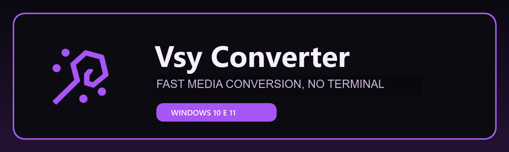
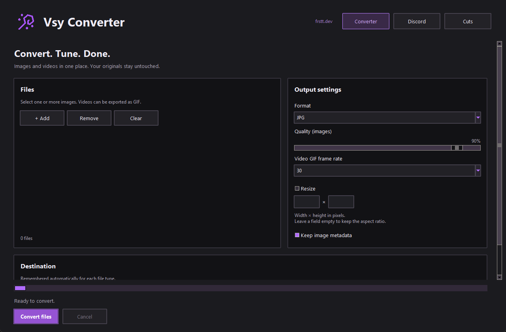
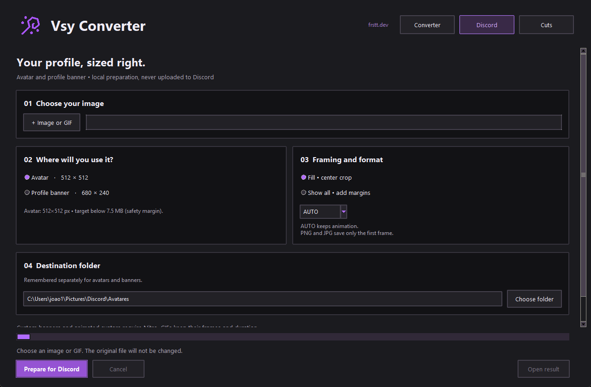
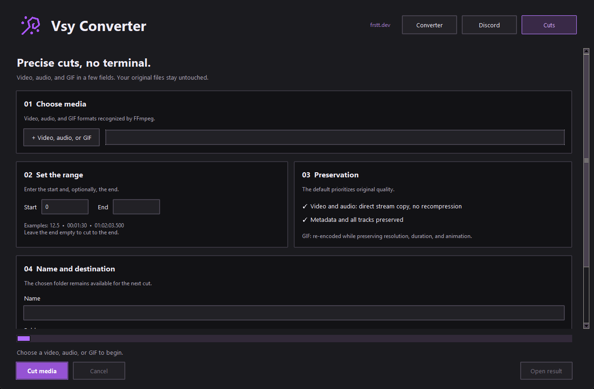

<div align="center">
  

  <p><strong>Simple, fast image conversion without a terminal.</strong></p>

  
  
  

  <br><br>
  <a href="https://github.com/frsttw/vsy-converter/releases/latest/download/Instalador-Vsy-Converter.exe">
    
  </a>
</div>

## About

**Vsy Converter** provides a graphical interface for ImageMagick and FFmpeg. Convert images, turn videos into GIFs, and cut media without memorizing commands or opening a terminal.

## Highlights

- Convert multiple files in one operation.
- Support for JPG, PNG, WebP, AVIF, GIF, BMP, TIFF, ICO, and PDF.
- Quality controls with visible, predictable results.
- Resize images while preserving the aspect ratio automatically.
- Option to keep or remove metadata.
- Original-file protection with automatic numbering for duplicate names.
- Destination folders remembered separately for each output type.
- Convert modern, legacy, professional, and mobile video formats supported by FFmpeg to GIF.
- GIF frame-rate control from 10 to 60 FPS, with the preference remembered.
- Graphite and violet interface with top navigation and organized cards.
- Actions remain accessible on smaller windows, with cancellation in every area.
- **Cuts** tab for video, audio, and GIF files with start/end controls and original-format output.
- Video and audio cuts use direct stream copy without recompression or quality loss.
- Complete installer with ImageMagick included.

## How to use

1. Add one or more images.
2. Choose the output format and quality.
3. Enable resizing if needed.
4. Select a destination folder.
5. Click **Convert files**.

## Interface



### Discord workspace



- Square 512×512 px avatars or 680×240 px profile banners.
- Center crop or full fit with margins, without distortion.
- AUTO keeps animations as GIF; PNG/JPG export only the first frame.
- Progressive optimization and actual-size validation, targeting below 7.5 MB for avatars and 9.5 MB for banners.
- GIFs preserve frames and duration; they may lose colors and avatar resolution (down to 128×128).
- If the target cannot be met, no oversized result is saved. Use a shorter clip or a static output.
- Independent folders and cancellation are remembered for avatars and banners.

### Cuts workspace



- Choose a start and end in seconds or `HH:MM:SS.000`; leave the end empty to use the end of the file.
- Videos and audio keep their streams, tracks, metadata, and format without recompression.
- Direct stream copy may align a start to the nearest keyframe in some videos; this avoids re-encoding and preserves original quality.
- GIFs are re-encoded only because cutting must remove frames, while preserving resolution, duration, and animation.
- The cuts folder is remembered separately and original files are never overwritten.

The targets are conservative application margins, not a promise of Discord acceptance. Custom banners and animated avatars depend on Nitro. This tab does not configure server banners or upload files automatically.

| Type | Input | Output |
| --- | --- | --- |
| Images | JPG, PNG, WebP, AVIF, GIF, BMP, TIFF, HEIC, SVG, PSD, RAW, and other supported formats | JPG, PNG, WebP, AVIF, GIF, BMP, TIFF, ICO, and PDF |
| Video | MP4, MKV, MOV, AVI, WebM, WMV, MPEG, MTS, VOB, 3GP, and other FFmpeg formats | GIF from 10 to 60 FPS |

> Availability of special image formats depends on the codecs included with ImageMagick. Videos are validated directly by FFmpeg.

## Installation

Download `Instalador-Vsy-Converter.exe` from **Releases** and follow the wizard. The package includes ImageMagick and FFmpeg and creates a Start-menu shortcut only; Vsy Converter does not start automatically with Windows.

Folder and FPS preferences from previous versions are preserved during upgrades.

## Technologies

- Python and Tkinter for the desktop application.
- ImageMagick as the conversion engine.
- FFmpeg for video reading and conversion.
- PyInstaller for the executable.
- Inno Setup for the Windows installer.

License notices and links are available in [`THIRD-PARTY-LICENSES.txt`](THIRD-PARTY-LICENSES.txt).

## Build locally

With Python 3, PyInstaller, and Inno Setup 6 installed, run:

```powershell
.\build-installer.ps1
```

The installer is created in `installer-output`.

Run the conversion and interface tests with ImageMagick and FFmpeg available:

```powershell
py -m unittest discover -v
```

## Structure

```text
Vsy Converter/
├── app.py                  # Desktop application
├── assets/                 # Visual identity and icon
├── docs/                   # Project-page images
├── build-installer.ps1     # Build automation
└── installer.iss           # Installer configuration
```

---

<div align="center">
  Developed by <a href="https://github.com/frsttw">@frsttw</a> · <a href="https://frstt.dev">frstt.dev</a>
</div>
